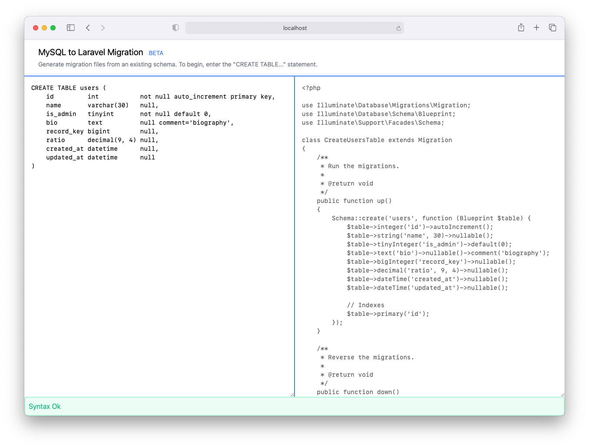

## MySQL to Laravel Migration

This utility transforms plain MySQL/MariaDB "CREATE TABLE..." statements into Laravel migrations.

Give it a try at https://thisiskj.github.io/mysql-to-laravel-migration/



This is a simple single file Vue 3 application running on Vite for speedy development.

It uses the [node-sql-parser](https://github.com/taozhi8833998/node-sql-parser) library to parse the SQL text.

## Contributing

To get a development environment setup:

```
yarn install
yarn run dev
```

## Unsupported CREATE TABLE features

Need support for:
- collation
- charset
- foreign keys
